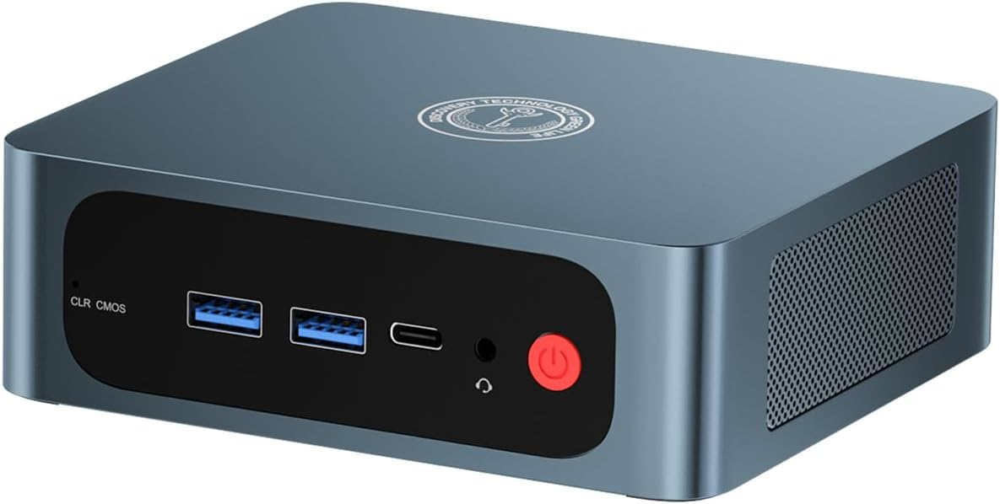

# Hardware

- [TRIGKEY S6 Mini PC](https://www.amazon.co.uk/dp/B0C3CR3XQQ)
- 8 Core 16 Thread Mini Computer Desktop PC Ryzen 7 Pro 6800U（Up to 4.7GHz） 
- 32G DDR4+1TB NVME SSD Micro PC
- 12Core 2600MHz HD graphics


# Software 

```bash
$ uname -a 
Linux trigkey 6.1.0-37-amd64 #1 SMP PREEMPT_DYNAMIC Debian 6.1.140-1 (2025-05-22) x86_64 GNU/Linux

$ cat /etc/os-release 
PRETTY_NAME="Debian GNU/Linux 12 (bookworm)"
NAME="Debian GNU/Linux"
VERSION_ID="12"
VERSION="12 (bookworm)"
VERSION_CODENAME=bookworm
ID=debian
HOME_URL="https://www.debian.org/"
SUPPORT_URL="https://www.debian.org/support"
BUG_REPORT_URL="https://bugs.debian.org/"
```

# Monitoring ⏱️

The system is [monitored](monitoring.md) exernally with a free tier of uptimerobot.

# DDNS 🗺️

I use [ddns](https://github.com/qdm12/ddns-updater/tree/master) to update the dynamic IP set by my ISP on all my domains in DigitalOcean. 

# Iterations 

## First

The [first iteration](first_iteration/README.md) of the lab runs applications as docker containers with `docker-compose` and uses a container running [caddy](https://caddyserver.com/) as the ingress. 

## Second 

I'm currently building a [second iteration](second_iteration/README.md), that will run a few VM with a `k8s` cluster to host the applications. 
