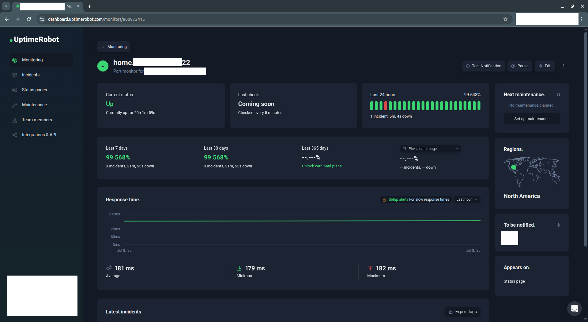
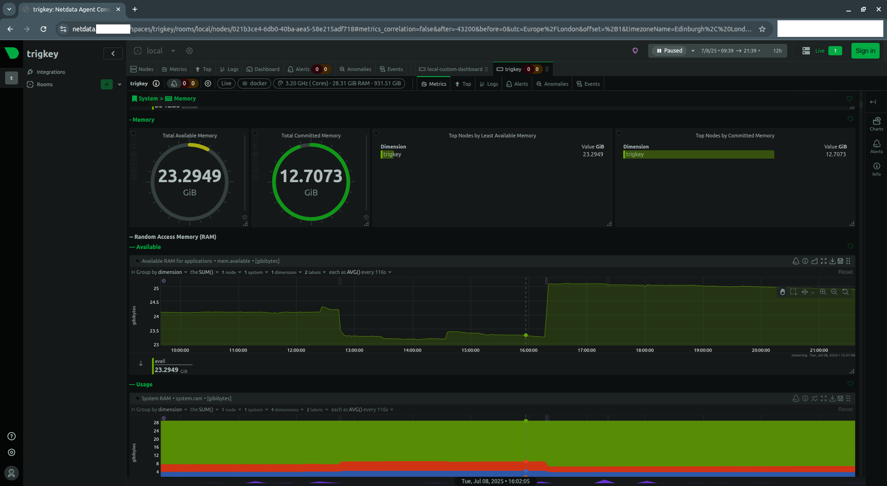

# External 
- External monitoring is provided by (uptimerobot)[https://uptimerobot.com/] with email alerts 

# Metrics / status 
- System status is available via a container running (netdata)[https://github.com/netdata/netdata]
